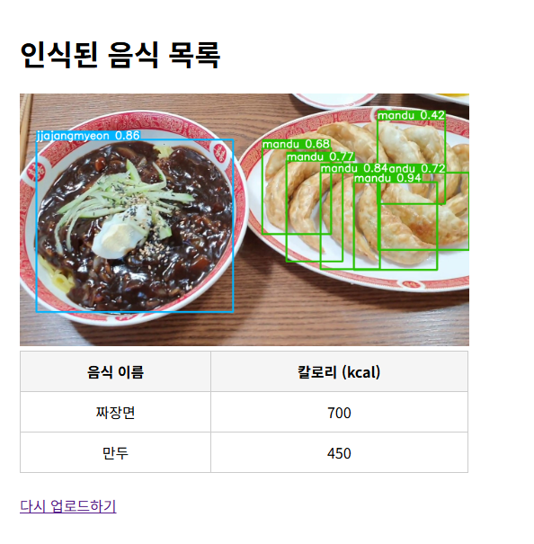

# Yolov5_Food_check

**Yolov5_Food_check**는 spring 프레임워크로 개발한 사이트에 접속 후 학습된 yolov5 모델을 이용하여 사진을 업로드시 음식의 이름과 칼로리를 표시해 줍니다.
- yolotest -> spring boot 웹 사이트
- yolov5-train -> 음식이 학습된 yolov5

---

- **모델 명칭**: Yolov5
- Food_Find 웹 사이트에 포함 하거나 새로운 어플리케이션으로 만들기전 테스트 입니다.

---

## 학습 결과 - 시각화

<table>
  <tr>
    <td align="center"><b>클래스별 F1-Confidence Curve</b></td>
    <td align="center"><b>데이터셋 시각화 결과</b></td>
  </tr>
  <tr>
    <td></td>
    <td></td>
  </tr>
</table>

---

## 결과 화면
<table>
    <tr>
    <td></td>
  </tr>
  </table>

---

## 📮 문의

- 이메일: `qhgus9346@gmail.com`
