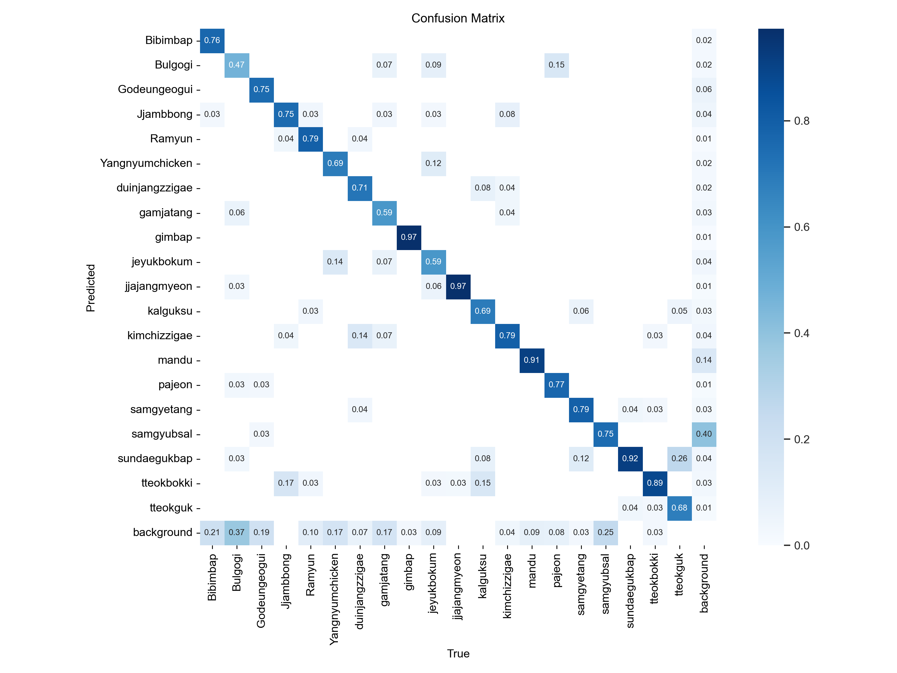
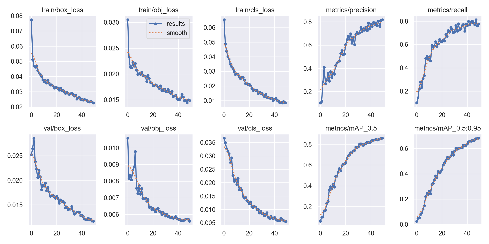

# Food_check_App

**Food_check_App**는 안드로이드 스튜디오로 개발한 어플에 접속 후 학습된 yolov5 모델을 이용하여 사진을 업로드시 음식의 이름과 칼로리를 표시해 줍니다.
- foodcheck -> 사용자 정보, 음식 및 칼로리 정보 처리 PHP 파일
- Yolov5 -> 음식이 학습된 yolov5의 runs 파일, 어플에서 보낸 이미지를 처리 및 yolov5실행을 해주는 fastapi 서버 파일
- MySql SCHEMAS -> MySql에 필요한 테이블 정보
- 어플 -> Branches -> master

---

## 🖥️ 프로젝트 개요

- 🎯 **주요 기능**:
  - 사용자 회원가입 및 로그인
  - 딥러닝 모델 기반 음식 실시간 예측
  - 오늘 하루 동안 섭취한 칼로리 표시
  
---

##🏗️ 사용기술

- **Android Studio(java)**: 플랫폼 앱 개발
- **PyTorch**: 분류 모델
- **FastApi**: 음식 예측 REST API
- **Apache**: PHP 서버(mysql과 연결되어 사용자 정보, 칼로리, 음식 저장 및 처리)
- **MySql**: 로그인, 회원가입, 사용자 정보 등 저장
- **PHP**: 사용자 정보, 칼로리, 음식 저장 처리 및 표시
  
---

## 학습 결과 - 시각화

<table>
  <tr>
    <td align="center"><b>confusion_matrix(혼돈행렬)</b></td>
  </tr>
    <tr>
    <td></td>
  </tr>
  <tr>
        <td align="center"><b>학습 로그 시각화 결과</b></td>
  </tr>
    <tr>
    <td></td>
  </tr>
</table>

## 결과 설명
confusion_matrix(혼돈행렬)
 - 자장면과 김밥이 97%로 가장 이미지를 잘 분류 하고 있고 불고기가 47%로 제대로 분류를 못하고 있습니다.

학습 로그 시각화 결과
 - metrics/precision: 정밀도를 나타내며 예측이 맞다고 한 것중 실제로 맞은 비율을 나타냅니다
    꾸준히 상승하여 틀리게 탐지한 것이 줄어듦을 볼 수 있습니다.

- metrics/recall: 재현율을 나타내며 실제 객체 중 예측에 잡힌 비율을 나타냅니다.
   초반에는 급상승 후 완만하게 증가 하여 더 많은 객체를 탐지하게 되었습니다.

- metrics/mAP_0.5: 객체 탐지 성능의 대표 지표로 IOU 가 0.5보다 높게 나오면 맞다고 판단합니다.
   약 0.85 이상에 도달하여 좋은 성능을 보이고 있습니다.

- val/box_loss, val/obj_loss, val/cls_loss
   전반적으로 감소하였고 학습뿐 아니라 검증 데이터에서도 성능 향상이 보이고 train보다 높거나 변동이 크지 않아 과적합으로 판단되지 않습니다.

---

## 서비스 구성도

<table>
    <tr>
    <td></td>
  </tr>
  <tr>
</table>

---

## 설명
### 앱에서 바로 DB로 가지 않은 이유

 앱에서 바로 DB 연결시 앱 소스 안에 DB Connention 정보가 들어있기에 노출이 되기때문에
 중간에 서버를 사용하여 처리 하게 개발 하였습니다.
 중계역활(서버)은 클라이언트로 내려오지 않고 해킹당하지 않는 이상 DB Connention이 노출 되지 않습니다.

### FastAPI 사용 이유

 Rest API를 쉽게 개발하고 안드로이드 앱에서 화면이 아닌 데이터를 원하기에 FastAPI를 사용하였습니다.


---

## App 구성

<table>
  <tr>
    <td align="center"><b>로그인 화면</b></td>
    <td align="center"><b>음식 및 칼로리 예측</b></td>
        <td align="center"><b>오늘 섭취한 칼로리</b></td>
  </tr>
    <tr>
    <td></td>
    <td></td>
    <td></td>
  </tr>
</table>
 
---

### 📦 데이터셋

- **출처 링크**: [Dataset](https://universe.roboflow.com/yong331/sk-shielders-module-project-3_koreanfood_detecting)
- **클래스 수**: 총 20종

```python
names: ['Bibimbap', 'Bulgogi', 'Godeungeogui',
'Jjambbong', 'Ramyun', 'Yangnyumchicken',
'duinjangzzigae', 'gamjatang', 'gimbap',
'jeyukbokum', 'jjajangmyeon', 'kalguksu',
'kimchizzigae', 'mandu', 'pajeon', 'samgyetang',
'samgyubsal', 'sundaegukbap', 'tteokbokki', 'tteokguk']
```

---

## 📌 향후 개선 방향

- 혼동이 심한 클래스에 대해 데이터 보강
- 유사 클래스 간의 차이를 부각시킬 수 있는 전처리 또는 모델 개선(Yolov8, v11)

---

## 📮 문의

- 이메일: `qhgus9346@gmail.com`
