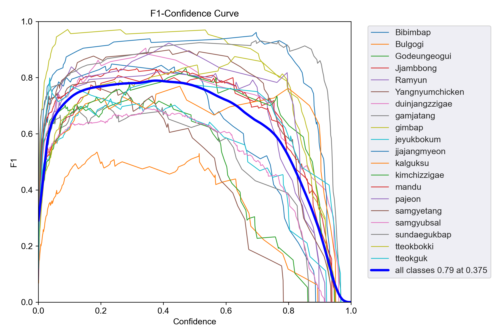
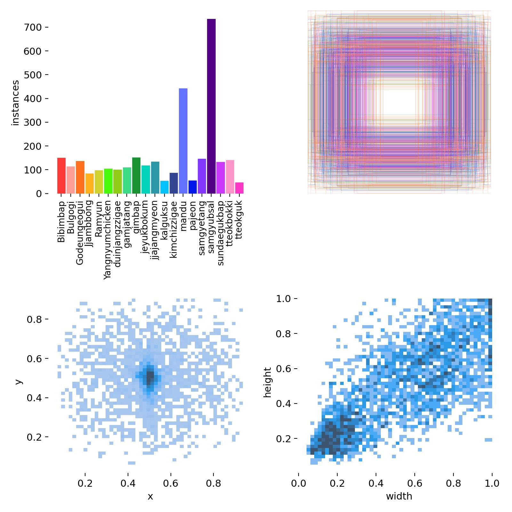
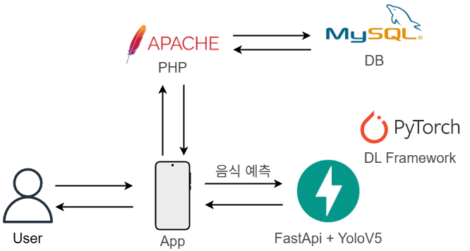
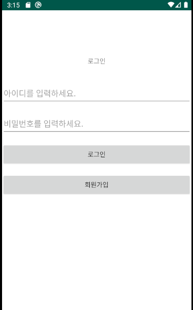

# Food_check_App

**Food_check_App**는 안드로이드 스튜디오로 개발한 어플에 접속 후 학습된 yolov5 모델을 이용하여 사진을 업로드시 음식의 이름과 칼로리를 표시해 줍니다.
- foodcheck -> 사용자 정보, 음식 및 칼로리 정보 처리 PHP 파일
- Yolov5 -> 음식이 학습된 yolov5의 runs 파일, 어플에서 보낸 이미지를 처리 및 yolov5실행을 해주는 fastapi 서버 파일
- MySql SCHEMAS -> MySql에 필요한 테이블 정보
- 어플 -> Branches -> master

---

## 🖥️ 프로젝트 개요

- 🎯 **주요 기능**:
  - 사용자 회원가입 및 로그인
  - 딥러닝 모델 기반 음식 실시간 예측
  - 오늘 하루 동안 섭취한 칼로리 표시
  
---

##🏗️ 사용기술

- **Android Studio(java)**: 플랫폼 앱 개발
- **PyTorch**: 분류 모델
- **FastApi**: 음식 예측 REST API
- **Apache**: PHP 서버(mysql과 연결되어 사용자 정보, 칼로리, 음식 저장 및 처리)
- **MySql**: 로그인, 회원가입, 사용자 정보 등 저장
- **PHP**: 사용자 정보, 칼로리, 음식 저장 처리 및 표시
  
---

## 학습 결과 - 시각화

<table>
  <tr>
    <td align="center"><b>클래스별 F1-Confidence Curve</b></td>
  </tr>
    <tr>
    <td></td>
  </tr>
  <tr>
        <td align="center"><b>데이터셋 시각화 결과</b></td>
  </tr>
    <tr>
    <td></td>
  </tr>
</table>

---

## 서비스 구성도

<table>
    <tr>
    <td></td>
  </tr>
  <tr>
</table>

---

## App 구성

<table>
  <tr>
    <td align="center"><b>로그인 화면</b></td>
    <td align="center"><b>음식 및 칼로리 예측</b></td>
        <td align="center"><b>오늘 섭취한 칼로리</b></td>
  </tr>
    <tr>
    <td></td>
    <td></td>
    <td></td>
  </tr>
</table>

---

### 📦 데이터셋

- **출처 링크**: [Dataset](https://universe.roboflow.com/yong331/sk-shielders-module-project-3_koreanfood_detecting)
- **클래스 수**: 총 20종

```python
names: ['Bibimbap', 'Bulgogi', 'Godeungeogui',
'Jjambbong', 'Ramyun', 'Yangnyumchicken',
'duinjangzzigae', 'gamjatang', 'gimbap',
'jeyukbokum', 'jjajangmyeon', 'kalguksu',
'kimchizzigae', 'mandu', 'pajeon', 'samgyetang',
'samgyubsal', 'sundaegukbap', 'tteokbokki', 'tteokguk']
```

---

## 📌 향후 개선 방향

- 클래스 수 확장(현재 한식 종류에 의해서만 학습된 상태) -> 양식, 일식 등
- 더 다양한 데이터셋 추가 확보(정확도 증가)

---

## 📮 문의

- 이메일: `qhgus9346@gmail.com`
